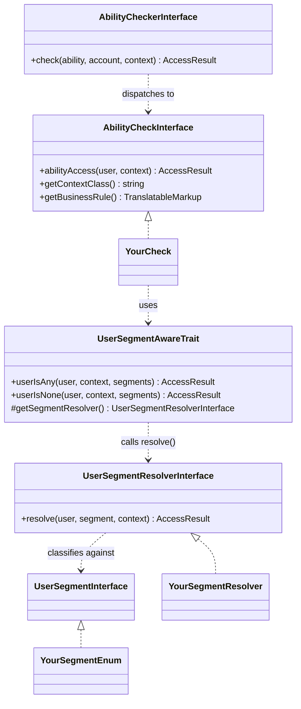

<!--
id: readme
tags: ''
-->

# user_ability

> Ask "can this user do X?" in Drupal through named, cache-aware ability checks instead of scattered permission logic.


## Summary

Access logic in a Drupal site tends to leak everywhere: a controller checks a permission, a form checks a role, a block checks ownership, and nobody can say in one place what "can publish an article" actually means. User Ability gives each business capability a name (an enum case such as `SiteAbility::PublishArticle`), puts the rule that decides it in one dedicated check service, and routes every question through a single dispatcher, `user_ability.checker`. The answer is always a cache-aware `AccessResult`, so it is safe to use in render arrays and route access. Each check also states its rule in plain language through `getBusinessRule()`, written for whoever owns the business decision. The module does not display these statements itself; list them wherever you document or audit your abilities, so a non-developer can confirm the system enforces what the business agreed to.

A check can optionally decide its answer by classifying the user into named segments — leaders, administrators, buyers, sellers, whatever your site's rules group users into — instead of writing permission/role logic inline. See "The segment mechanism (optional)" below.

## Quick Start

Enable the module, then add these three pieces to one of your own modules (`my_module` here).

An ability enum, one case per capability, named as a verb phrase:

```php
// my_module/src/Enum/SiteAbility.php
namespace Drupal\my_module\Enum;

use Drupal\user_ability\AbilityInterface;

enum SiteAbility implements AbilityInterface {
  case ViewReports;

  public function jsonSerialize(): string {
    return $this->name;
  }
}
```

A check that decides it. This one needs no context beyond the user, so it declares `NullContext`:

```php
// my_module/src/AbilityCheck/ViewReportsCheck.php
namespace Drupal\my_module\AbilityCheck;

use Drupal\Core\Access\AccessResult;
use Drupal\Core\StringTranslation\TranslatableMarkup;
use Drupal\user\UserInterface;
use Drupal\user_ability\AbilityCheckInterface;
use Drupal\user_ability\AbilityContextInterface;
use Drupal\user_ability\NullContext;

final class ViewReportsCheck implements AbilityCheckInterface {

  public static function getContextClass(): string {
    return NullContext::class;
  }

  public static function getBusinessRule(): TranslatableMarkup {
    return new TranslatableMarkup('Anyone allowed to access site reports can view reports.');
  }

  public function abilityAccess(UserInterface $user, AbilityContextInterface $context): AccessResult {
    return AccessResult::allowedIfHasPermission($user, 'access site reports');
  }

}
```

A service tagged `ability_check`, whose `ability` attribute is the fully-qualified case, with no leading backslash:

```yaml
# my_module/my_module.services.yml
services:
  my_module.ability_check.view_reports:
    class: Drupal\my_module\AbilityCheck\ViewReportsCheck
    tags:
      -
        name: ability_check
        ability: 'Drupal\my_module\Enum\SiteAbility::ViewReports'
```

Rebuild the container (`drush cr`) and ask the question anywhere:

```php
use Drupal\my_module\Enum\SiteAbility;

$result = \Drupal::service('user_ability.checker')
  ->check(SiteAbility::ViewReports, \Drupal::currentUser());

$result->isAllowed();
```

For a user with the `access site reports` permission, `isAllowed()` returns `TRUE`; for everyone else it returns `FALSE`. `$result` carries the permission cache context, so it can go straight into a render array or a route access callback.

## Requirements

- PHP 8.1 or newer. Abilities are PHP enums, and the module uses `readonly` properties.
- Drupal 9 or 10. The module declares `core_version_requirement: ^9 || ^10`, so Drupal 11 will not enable it.

## Installation

The module is not on Packagist or drupal.org, so install it from its git repository.

**With Composer.** Add the repository to your project's `composer.json`, then require the development branch:

```bash
composer config repositories.user_ability vcs git@github.com:aklump/drupal_user_ability.git
composer require aklump_drupal/user_ability:dev-main
drush en user_ability
```

The package type is `drupal-custom-module`, so a project built from `drupal/recommended-project` places it under `web/modules/custom/user_ability`.

**By hand.** Clone it into your custom modules directory and enable it:

```bash
git clone git@github.com:aklump/drupal_user_ability.git web/modules/custom/user_ability
drush en user_ability
```

Enabling it registers the `user_ability.checker` service and a `user_ability` logger channel. It adds no configuration, permissions, routes or database tables.

## Usage

### The four pieces

- **Ability** (`AbilityInterface`): an enum naming a business capability. Name cases as verbs or verb phrases (`PublishArticle`, `DeleteComment`), never as a role or a permission. The interface requires `\JsonSerializable`, because `json_encode()` cannot serialize a pure enum and silently returns `FALSE` for the whole payload that contains one. A backed enum is allowed but not required.
- **Context** (`AbilityContextInterface`): a value object carrying whatever a check needs beyond the account: a node, a group, a status. It is an empty marker interface; you define one class per shape.
- **Check** (`AbilityCheckInterface`): one service per ability that composes permissions, roles, ownership and anything else into one `AccessResult`, with its cache metadata.
- **Checker** (`AbilityCheckerInterface`, implemented by `AbilityChecker`, service `user_ability.checker`): the dispatcher. Its one public question is `check(AbilityInterface $ability, AccountInterface $account, ?AbilityContextInterface $context = NULL): AccessResult`. It loads the account as a user entity (the anonymous user for an anonymous account) before handing it to the check, which is why checks receive a `UserInterface`.

### The segment mechanism (optional)

A check can decide its answer by classifying the user into named segments
instead of writing permission/role logic inline. Three pieces, parallel to
the four above:

- **Segment** (`UserSegmentInterface`): an enum naming a fixed set of user
  buckets — leaders, administrators, buyers, sellers, whatever your site's
  rules group users into. A bare marker, like `AbilityInterface`.
- **Segment resolver** (`UserSegmentResolverInterface`): one service per
  site that decides membership, returning a cache-aware `AccessResult` that
  is `allowed()` or `neutral()` — never `forbidden()`.
- **`UserSegmentAwareTrait`**: gives a check `userIsAny()` (allows if the
  user is in any of the given segments) and `userIsNone()` (vetoes if they
  are). A check `use`s the trait and supplies its resolver via
  `getSegmentResolver()`, the same abstract-getter shape `AbilityAwareTrait`
  uses for its checker/account.

An enum naming your site's buckets, implementing the marker interface:

```php
// my_module/src/Enum/SiteSegment.php
namespace Drupal\my_module\Enum;

use Drupal\user_ability\UserSegmentInterface;

enum SiteSegment implements UserSegmentInterface {
  case Leader;
  case Administrator;
  case Buyer;
  case Seller;
}
```

A check composes segments instead of inlining the membership test:

```php
final class ApproveOrderCheck implements AbilityCheckInterface {
  use UserSegmentAwareTrait;

  public function __construct(private readonly UserSegmentResolverInterface $segmentResolver) {}

  protected function getSegmentResolver(): UserSegmentResolverInterface {
    return $this->segmentResolver;
  }

  public function abilityAccess(UserInterface $user, AbilityContextInterface $context): AccessResult {
    return $this->userIsAny($user, $context, SiteSegment::Leader, SiteSegment::Administrator);
  }
}
```

See `AGENTS.md` for the resolver invariant and why there is no
`userIsEvery()` yet.

How the two mechanisms relate:



A check written against `UserSegmentAwareTrait` still dispatches through the
same `AbilityCheckerInterface`/`AbilityChecker` as any other check — it just
decides its own `abilityAccess()` by composing segments instead of writing
permission logic inline.

### Registering checks

A compiler pass collects every `ability_check`-tagged service at container-build time and registers it under its `ability` attribute. A check and an ability pair off one to one: `abilityAccess()` is never told which ability it is deciding, and `getBusinessRule()` states a single rule. The pass enforces that, and fails the container build with a `\LogicException` when:

- **a service carries more than one `ability_check` tag.** Give each ability its own check class, so each has its own business rule.
- **two services name the same ability.** Remove one of them, or give it an ability of its own.

### Checks that need a context

Define a context class for the data the check needs, and declare it from `getContextClass()`:

```php
namespace Drupal\my_module\Context;

use Drupal\node\NodeInterface;
use Drupal\user_ability\AbilityContextInterface;

final class NodeContext implements AbilityContextInterface {

  public function __construct(
    public readonly NodeInterface $node,
  ) {}

}
```

```php
namespace Drupal\my_module\AbilityCheck;

use Drupal\Core\Access\AccessResult;
use Drupal\Core\StringTranslation\TranslatableMarkup;
use Drupal\my_module\Context\NodeContext;
use Drupal\user\UserInterface;
use Drupal\user_ability\AbilityCheckInterface;
use Drupal\user_ability\AbilityContextInterface;

final class PublishArticleCheck implements AbilityCheckInterface {

  public static function getContextClass(): string {
    return NodeContext::class;
  }

  public static function getBusinessRule(): TranslatableMarkup {
    return new TranslatableMarkup('Editors can publish any article; authors can publish their own.');
  }

  public function abilityAccess(UserInterface $user, AbilityContextInterface $context): AccessResult {
    $result = AccessResult::allowedIf($user->hasPermission('administer nodes') || $user->hasPermission('publish article content'))
      ->cachePerPermissions()
      ->addCacheableDependency($context->node);

    $is_author = (int) $context->node->getOwnerId() === (int) $user->id();
    return $result->orIf(
      AccessResult::allowedIf($is_author && $user->hasPermission('publish own article content'))
        ->addCacheableDependency($context->node)
        ->cachePerPermissions()
    );
  }

}
```

This check and the call below assume a `PublishArticle` case in `SiteAbility` and a tagged service for `PublishArticleCheck`, added the same way as in the Quick Start. The two publish permissions are examples; your site defines them.

Pass the context as the third argument:

```php
use Drupal\my_module\Context\NodeContext;
use Drupal\my_module\Enum\SiteAbility;

$can_publish = \Drupal::service('user_ability.checker')
  ->check(SiteAbility::PublishArticle, \Drupal::currentUser(), new NodeContext($node))
  ->isAllowed();
```

The checker enforces the declared class before it calls the check, so `abilityAccess()` never has to validate the shape of `$context`. When you pass no context, the checker substitutes `NullContext`, so a check never receives `NULL`. It follows that calling a check which declares a specific context, such as `PublishArticleCheck`, without one throws `\InvalidArgumentException`, because `NullContext` is not a `NodeContext`.

### Cache metadata

A check returns a concrete `AccessResult`, not just an `AccessResultInterface`, so the checker can add the user as a cacheable dependency to every result; a check never needs `->addCacheableDependency($user)` itself. The check must still carry the rest of its cache metadata: `->cachePerPermissions()` when a permission is involved, `->addCacheableDependency()` for every context entity it reads, and `->setCacheMaxAge()` for time-based rules. The user dependency adds no cache tags for the anonymous user, so a check whose answer can vary for anonymous visitors must also call `->cachePerPermissions()` or `->cachePerUser()`.

### A `can()` / `abilityTo()` facade

If your site wraps accounts in its own object, `AbilityAwareTrait` gives it `can()` (a boolean) and `abilityTo()` (the cache-aware `AccessResult`). You supply the checker and the account:

```php
use Drupal\Core\Session\AccountInterface;
use Drupal\user_ability\AbilityAwareTrait;
use Drupal\user_ability\AbilityCheckerInterface;

class MyWrappedUser {
  use AbilityAwareTrait;

  public function __construct(
    private readonly AccountInterface $account,
    private readonly AbilityCheckerInterface $abilityChecker,
  ) {}

  protected function getAbilityChecker(): AbilityCheckerInterface {
    return $this->abilityChecker;
  }

  protected function getAbilityAccount(): AccountInterface {
    return $this->account;
  }
}

// $user->can(SiteAbility::ViewReports) returns TRUE or FALSE.
// $user->abilityTo(SiteAbility::PublishArticle, new NodeContext($node)) returns the result with its cache metadata.
```

Use `abilityTo()` for anything that renders; `can()` discards the cache metadata. When the wrapper is itself a service, inject the checker with `@user_ability.checker`. Type-hint `AbilityCheckerInterface`, as above, not the `AbilityChecker` class, so the service can be decorated or replaced; the interface is also aliased for autowiring.

### Route access

The module adds no route requirement of its own. To guard a route with an ability, call the checker from your own `_custom_access` callback and return its result.

### When something is wrong

| Situation                                                                                                 | What happens                                                                                    |
|-----------------------------------------------------------------------------------------------------------|-------------------------------------------------------------------------------------------------|
| No check is registered for the ability                                                                    | `check()` returns `AccessResult::forbidden()` and logs a warning to the `user_ability` channel. |
| The account no longer resolves to a user (deleted mid-request)                                            | `check()` returns `AccessResult::forbidden()` and logs a warning.                               |
| The context (or `NullContext`, when none is passed) is not an instance of the check's `getContextClass()` | `check()` throws `\InvalidArgumentException`.                                                   |
| A tagged service has no `ability` attribute, names an undefined case, or starts the case with `\`         | The container build fails with a `\LogicException` naming the service.                          |
| A service has more than one `ability_check` tag, or two services name the same ability                    | The container build fails with a `\LogicException` naming the service(s).                       |

The no-check result carries no cache metadata, since it only changes when the container is rebuilt. The deleted-account result is uncacheable (max-age 0), because it describes one account, not every visitor.

### Running the tests

The unit tests live in `tests/src/Unit/`: `AbilityCheckerTest.php` covers the checker, `AbilityCheckCollectorPassTest.php` covers the tag rules, and `UserSegmentAwareTraitTest.php` covers the segment composition helpers. They extend Drupal's `UnitTestCase`, so run them from a Drupal site that has the module installed:

```bash
vendor/bin/phpunit -c web/core web/modules/custom/user_ability/tests
```

## License

[GPL-2.0-or-later](../../../LICENSE)
